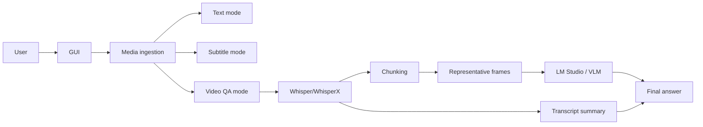

### AskVLM — Multimodal GUI: Text, Subtitles, and Video-Based Answers

Date: 2026-03-29

---

### 1. Context

The current repository already contains a working foundation for local transcription, subtitle generation, preview, and burn-in. The natural next step is not a separate new project, but an extension of the current GUI to cover three user scenarios:

- get plain text;
- get subtitles;
- get an LLM answer based on a video.

Product strategy conclusion: the repository remains unified for now. Splitting into a new project only makes sense if an independent release cycle, a separate audience, or a substantially different dependency set emerges.

---

### 2. Goals

- Build one simple GUI with a mode selection.
- Hide the technical complexity of chunking, frame sampling, and LM Studio communication.
- Keep the existing subtitle-first workflow working and stable.
- Support a local LLM mode without a mandatory cloud dependency.

---

### 3. Working Modes

#### 3.1 Text mode

The user loads media and gets a clean transcript text.

Characteristics:

- minimum post-processing;
- suitable for quick drafts;
- can be exported as TXT or JSON;
- useful as a base mode for QA and further analysis.

#### 3.2 Subtitle mode

The user gets subtitles with timecodes and export to SRT/VTT/JSON.

Characteristics:

- remains the primary mode for the current workflow;
- uses existing readability rules;
- retains preview and burn-in;
- must remain the most stable and predictable scenario.

#### 3.3 Video QA mode

The user asks a question about a video, and the system assembles an answer from the transcript and frames.

Characteristics:

- input: video + question;
- output: LLM answer;
- main backend pipeline: `Whisper/WhisperX -> chunking -> frames -> LM Studio -> final answer`;
- OCR is not mandatory thanks to the use of a multimodal LLM.

---

### 4. Architecture Diagram

Diagram explanation:

- shared ingest and transcription remain unified;
- differentiation starts after meaning extraction;
- subtitles and text use an already prepared document;
- QA mode builds a separate answer route.

---

### 5. Video QA Flow

#### 5.1 Preparation

1. The system extracts audio and obtains a transcript with timecodes.
2. The transcript is split into semantic chunks.
3. Several representative frames are selected for each chunk.
4. The request to LM Studio is formed as a combination of text and images.

#### 5.2 Representative Frames

"Representative frames" here does not mean codec keyframes, but frames that best represent the semantic segment of the video.

Basic heuristics:

- frame after a scene cut;
- frame at the beginning of a semantic block;
- frame in the middle of a long block if there is a visual change;
- frame with a readable interface or slide if the question is about on-screen content.

#### 5.3 OCR

OCR is not included in the mandatory path.

Why:

- the vision model can already read some text directly from the image;
- OCR adds another processing layer and another source of errors;
- OCR is not needed if the task is the general meaning of a scene, not an exact transcription of fine text.

When OCR is still useful:

- small UI text;
- tables;
- slides with dense information;
- documents in frame.

#### 5.4 Context Budget

Before sending the request, the budget must be estimated:

- text can be counted precisely in advance;
- images must be counted conservatively;
- `stopAtLimit` is used only as an emergency limiter, not as an orchestration tool.

Practical conclusion:

- long videos should not be sent as a single request;
- better to send chunks and then assemble the final answer;
- one large request is acceptable only as an optional fast path for a short clip.

---

### 6. UI/UX

#### 6.1 Main Screen

The top-level GUI must give the user one clear choice:

- Text;
- Subtitles;
- Video QA.

#### 6.2 Results

Results must be displayed differently for each mode:

- Text mode — standard text viewer;
- Subtitle mode — current editor/preview/subtitle flow;
- Video QA mode — chat-like answer with citations, timecodes, and links to frames.

#### 6.3 UX Principle

The user must not see:

- chunking;
- frame selection;
- budget preflight;
- internal retries;
- details of LM Studio communication.

They should only see:

- what they loaded;
- what they asked;
- what they received;
- where the answer is anchored to the video.

---

### 7. Naming and Product Frame

The project's public brand is already aligned on **AskVLM**.

Further steps on technical naming, if needed, can proceed separately:

1. Bring migration-sensitive identifiers to the new brand without losing compatibility.
2. Preserve historical keys and metadata where needed for past sessions and artifacts.
3. Do not conflate physical repository rename with the product name in GUI and documentation.

This allows keeping UX and documentation under a unified brand without breaking backward compatibility of old data.

---

### 8. Risks

- Do not turn one GUI into three poorly connected applications.
- Do not make video QA rely on a full raw-video request as the only path.
- Do not make OCR mandatory for all scenes.
- Do not break the current subtitle workflow in favor of the new mode.
- Do not overestimate LM Studio context: a large limit does not mean any packing will be stable.

---

### 9. First Increment

Minimum reasonable step:

1. Add mode selection to the GUI.
2. Extract a common result contract.
3. Add a Video QA orchestrator on top of the current pipeline.
4. Connect `LM Studio` for `text + images`.
5. Keep existing text/subtitle export paths without regressions.
6. Add tests for mode routing, chunk assembly, and answer format.

---

### 10. Related Files

- [gui/main_window.py](../gui/main_window.py)
- [core/pipelines.py](../core/pipelines.py)
- [core/ffmpeg.py](../core/ffmpeg.py)
- [editing/text_model.py](../editing/text_model.py)
- [utils/exporters.py](../utils/exporters.py)
- [TODO.md](../TODO.md)
