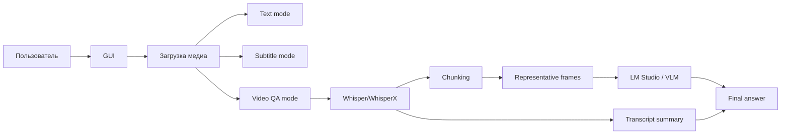

### AskVLM — Мультимодальный GUI: текст, субтитры и ответы по видео

Дата: 2026-03-29

---

### 1. Контекст

Текущий репозиторий уже содержит рабочую базу для локальной транскрипции, генерации субтитров, предпросмотра и прожига. Следующий логичный шаг — не отдельный новый проект, а расширение текущего GUI до трёх пользовательских сценариев:

- получить просто текст;
- получить субтитры;
- получить ответ от LLM по видео.

Вывод по продуктовой стратегии: репозиторий пока остаётся единым. Разделение на новый проект имеет смысл только если появится независимый релизный цикл, отдельная аудитория или резко иной набор зависимостей.

---

### 2. Цели

- Сделать один простой GUI с выбором режима работы.
- Скрыть техническую сложность chunking, sampling кадров и общения с LM Studio.
- Оставить существующий subtitle-first workflow рабочим и стабильным.
- Поддержать локальный LLM-режим без обязательной облачной зависимости.

---

### 3. Режимы работы

#### 3.1 Text mode

Пользователь загружает медиа и получает чистый текст транскрипта.

Характеристики:

- минимум постобработки;
- пригоден для быстрых черновиков;
- может экспортироваться как TXT или JSON;
- полезен как базовый режим для QA и для дальнейшего анализа.

#### 3.2 Subtitle mode

Пользователь получает субтитры с таймкодами и экспортом в SRT/VTT/JSON.

Характеристики:

- остаётся основным режимом для текущего workflow;
- использует существующие правила читабельности;
- сохраняет предпросмотр и burn-in;
- должен оставаться самым стабильным и предсказуемым сценарием.

#### 3.3 Video QA mode

Пользователь задаёт вопрос по видео, а система собирает ответ из транскрипта и кадров.

Характеристики:

- вход: видео + вопрос;
- выход: ответ LLM;
- основной backend-контур: `Whisper/WhisperX -> chunking -> frames -> LM Studio -> final answer`;
- OCR не обязателен за счёт использования мультимодальной LLM

---

### 4. Архитектурная схема

Смысл схемы:

- общий ingest и транскрипция остаются едиными;
- различие начинается после извлечения смысла;
- subtitles и text используют уже готовый документ;
- QA-режим строит отдельный маршрут ответа.

---

### 5. Поток Video QA

#### 5.1 Подготовка

1. Система извлекает аудио и получает транскрипт с таймкодами.
2. Транскрипт режется на смысловые чанки.
3. Для каждого чанка подбираются несколько репрезентативных кадров.
4. Запрос к LM Studio формируется как комбинация текста и изображений.

#### 5.2 Репрезентативные кадры

Под `representative frames` здесь понимаются не codec keyframes, а кадры, которые лучше всего представляют смысловой участок видео.

Базовые эвристики:

- кадр после смены сцены;
- кадр в начале смыслового блока;
- кадр в середине длинного блока, если там есть визуальное изменение;
- кадр с читаемым интерфейсом или слайдом, если вопрос про экранный контент.

#### 5.3 OCR

OCR не включается в обязательный путь.

Почему:

- vision-модель уже умеет читать часть текста прямо с изображения;
- OCR добавляет ещё один слой обработки и ещё один источник ошибок;
- OCR не нужен, если задача — общий смысл сцены, а не точная расшифровка мелкого текста.

Когда OCR всё же полезен:

- мелкий интерфейсный текст;
- таблицы;
- слайды с плотной информацией;
- документы в кадре.

#### 5.4 Бюджет контекста

Перед отправкой запроса нужно оценивать бюджет:

- текст можно посчитать заранее точно;
- изображения нужно учитывать консервативно;
- `stopAtLimit` используется только как аварийный ограничитель, а не как средство оркестрации.

Практический вывод:

- длинные видео не надо пытаться слать целиком одним запросом;
- лучше отправлять чанки и потом собирать финальный ответ;
- один большой запрос допустим только как optional fast path для короткого ролика.

---

### 6. UI/UX

#### 6.1 Основной экран

Верхний уровень GUI должен давать пользователю один понятный выбор:

- Text;
- Subtitles;
- Video QA.

#### 6.2 Результаты

Результат должен отображаться по-разному для каждого режима:

- Text mode — обычный текстовый viewer;
- Subtitle mode — текущий редактор/preview/subtitle flow;
- Video QA mode — чатоподобный ответ с цитатами, таймкодами и ссылками на кадры.

#### 6.3 UX-принцип

Пользователь не должен видеть:

- chunking;
- frame selection;
- budget preflight;
- внутренние retries;
- особенности общения с LM Studio.

Он должен видеть только:

- что загрузил;
- что спросил;
- что получил;
- где ответ привязан к видео.

---

### 7. Нейминг и продуктовая рамка

Публичный бренд проекта уже выровнен на **AskVLM**.

Дальнейшие шаги по техническому неймингу, если они понадобятся, могут идти отдельно:

1. Довести migration-sensitive identifiers до нового бренда без потери совместимости.
2. Сохранить исторические ключи и метаданные там, где это нужно для прошлых сессий и артефактов.
3. Не смешивать физический rename репозитория с продуктовым именем в GUI и документации.

Это позволяет удерживать UX и документацию под единым брендом, не ломая совместимость старых данных.

---

### 8. Риски

- Не превратить один GUI в три плохо связанных приложения.
- Не завязать video QA на полный raw-video запрос как на единственный путь.
- Не сделать OCR обязательным для всех сцен.
- Не сломать текущий subtitle workflow ради нового режима.
- Не переоценить контекст LM Studio: большой лимит не означает, что любая упаковка будет устойчивой.

---

### 9. Первый инкремент

Минимальный разумный шаг:

1. Добавить выбор режима в GUI.
2. Вынести общий result contract.
3. Добавить Video QA orchestrator поверх текущего pipeline.
4. Подключить `LM Studio` для `text + images`.
5. Сохранить существующие text/subtitle export пути без регрессий.
6. Добавить тесты на mode routing, chunk assembly и формат ответа.

---

### 10. Связанные файлы

- [gui/main_window.py](../gui/main_window.py)
- [core/pipelines.py](../core/pipelines.py)
- [core/ffmpeg.py](../core/ffmpeg.py)
- [editing/text_model.py](../editing/text_model.py)
- [utils/exporters.py](../utils/exporters.py)
- [TODO.md](../TODO.md)

