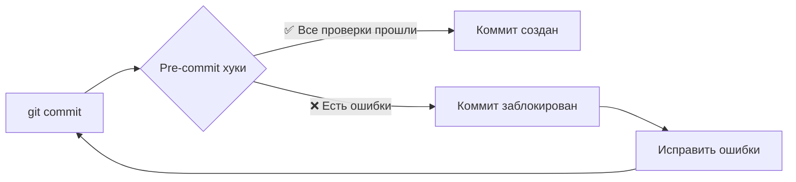

# Pre-commit Hooks Guide

## 🔗 Что такое Pre-commit хуки?

**Pre-commit хуки** — это автоматические скрипты, которые запускаются **перед каждым коммитом** в Git и проверяют качество вашего кода. Если проверки не проходят, коммит блокируется до исправления ошибок.

### 🎯 Основные преимущества:

1. **Автоматическая проверка** — не нужно помнить о запуске линтеров
2. **Предотвращение плохого кода** — ошибки ловятся до попадания в репозиторий
3. **Единые стандарты** — все разработчики используют одинаковые правила
4. **Экономия времени** — проблемы решаются локально, а не в CI/CD

## 🛠️ Как это работает?



## 📋 Наши Pre-commit проверки

### 🔍 **Общие проверки файлов:**

-   **Trailing whitespace** — удаление лишних пробелов в конце строк
-   **End of file fixer** — добавление пустой строки в конец файлов
-   **YAML/TOML/JSON validation** — проверка синтаксиса конфигурационных файлов
-   **Merge conflicts** — обнаружение неразрешенных конфликтов
-   **Large files** — предупреждение о файлах больше 10MB

### 🐍 **Python-специфичные проверки:**

-   **Ruff linting** — быстрая проверка стиля и ошибок
-   **Ruff formatting** — автоматическое форматирование кода
-   **MyPy** — проверка типов
-   **Bandit** — анализ безопасности
-   **AST validation** — проверка синтаксиса Python

### 🔐 **Безопасность:**

-   **Detect secrets** — поиск случайно добавленных паролей/ключей

## 🚀 Установка и использование

### 1. Установка pre-commit

```bash
# Установить pre-commit
pip install pre-commit

# Или через наш Makefile
make setup-dev
```

### 2. Активация хуков

```bash
# Установить хуки в текущий репозиторий
pre-commit install

# Проверить, что хуки установлены
pre-commit --version
```

### 3. Ручной запуск

```bash
# Запустить на всех файлах
pre-commit run --all-files

# Запустить только на измененных файлах
pre-commit run

# Запустить конкретный хук
pre-commit run ruff
```

## 💡 Практические примеры

### ✅ **Успешный коммит:**

```bash
$ git commit -m "Add new feature"

Trim Trailing Whitespace.................................................Passed
Fix End of Files.........................................................Passed
Check YAML...............................................................Passed
Ruff Linting.............................................................Passed
Ruff Formatting..........................................................Passed
MyPy Type Check..........................................................Passed
Bandit Security Check....................................................Passed

[main 1a2b3c4] Add new feature
 2 files changed, 15 insertions(+), 3 deletions(-)
```

### ❌ **Заблокированный коммит:**

```bash
$ git commit -m "Add buggy code"

Ruff Linting.............................................................Failed
- hook id: ruff
- exit code: 1

main.py:15:1: F401 [*] `os` imported but unused
main.py:23:5: E722 Do not use bare `except`

MyPy Type Check..........................................................Failed
- hook id: mypy
- exit code: 1

main.py:25: error: Function is missing a return type annotation
```

## 🔧 Настройка и конфигурация

### Файл `.pre-commit-config.yaml`

```yaml
repos:
    - repo: https://github.com/astral-sh/ruff-pre-commit
      rev: v0.1.7
      hooks:
          - id: ruff
            args: [--fix, --exit-non-zero-on-fix]
          - id: ruff-format
```

### Пропуск хуков (в крайних случаях)

```bash
# Пропустить все хуки (НЕ РЕКОМЕНДУЕТСЯ!)
git commit --no-verify -m "Emergency fix"

# Пропустить конкретный хук
SKIP=mypy git commit -m "WIP: type annotations"
```

## 🎛️ Управление хуками

### Обновление хуков

```bash
# Обновить версии хуков до последних
pre-commit autoupdate

# Очистить кеш хуков
pre-commit clean
```

### Отключение хуков

```bash
# Временно отключить хуки
pre-commit uninstall

# Включить обратно
pre-commit install
```

## 🚨 Решение проблем

### **Проблема:** Хуки работают слишком медленно

**Решение:**

```bash
# Запускать только на измененных файлах
pre-commit run

# Использовать быстрые проверки
python test.py --quick
```

### **Проблема:** Конфликт версий зависимостей

**Решение:**

```bash
# Обновить pre-commit
pip install --upgrade pre-commit

# Пересоздать окружение хуков
pre-commit clean
pre-commit install
```

### **Проблема:** Ложные срабатывания

**Решение:** Настроить исключения в `.pre-commit-config.yaml`:

```yaml
- id: mypy
  exclude: ^(tests/|scripts/)
```

## 📊 Интеграция с IDE

### **VS Code**

Установите расширения:

-   `ms-python.ruff` — Ruff linting
-   `ms-python.mypy-type-checker` — MyPy integration

### **PyCharm**

1. Settings → Tools → External Tools
2. Добавить pre-commit как внешний инструмент
3. Настроить горячие клавиши

## 🎯 Best Practices

1. **Коммитьте часто** — маленькие изменения проверяются быстрее
2. **Исправляйте ошибки сразу** — не накапливайте технический долг
3. **Используйте auto-fix** — многие ошибки исправляются автоматически
4. **Настройте IDE** — интегрируйте линтеры в редактор
5. **Обучите команду** — все должны понимать правила

## 🔄 Workflow с pre-commit

```bash
# 1. Разработка
vim my_file.py

# 2. Добавление в staging
git add my_file.py

# 3. Коммит (автоматически запускаются хуки)
git commit -m "Implement new feature"

# 4. Если есть ошибки - исправляем
python test.py --format-only  # автофикс
vim my_file.py               # ручные исправления

# 5. Повторный коммит
git add my_file.py
git commit -m "Implement new feature"
```

---

**💡 Помните:** Pre-commit хуки — это ваш помощник, а не препятствие. Они помогают поддерживать высокое качество кода и экономят время всей команды!
